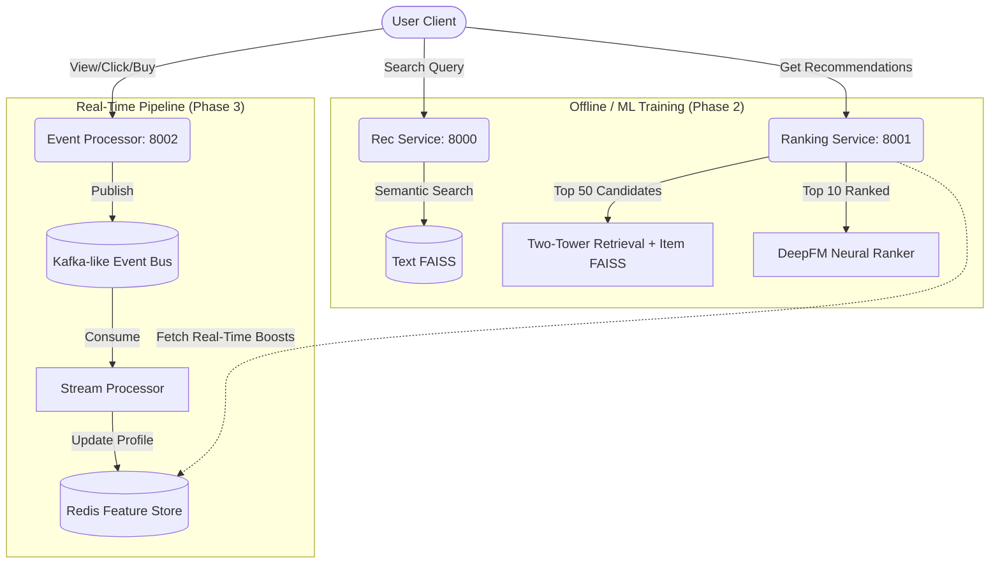

<div align="center">
  <h1>AURORA AI 🌌</h1>
  <p><strong>Enterprise-Scale Real-Time Recommendation & Intelligence Platform</strong></p>
  <p><em>Unified Recommendations, Retrieval Intelligence, Agentic Personalization, and Real-Time Ranking at Planet Scale.</em></p>
</div>

---

## 🚀 Overview

**AURORA AI** is a flagship MLOps and Machine Learning portfolio project designed to demonstrate enterprise-grade capabilities mirroring the architecture of modern AI platforms like Netflix, Spotify, Amazon, and TikTok.

Rather than just another "simple collaborative filtering script," AURORA AI implements a full-scale **Multi-Stage Recommender System** integrated with **Real-Time Event Streaming**, an in-memory **Feature Store**, and **MLflow** for experiment tracking.

## 🏗 Architecture

The platform architecture is divided into decoupled microservices, handling both offline model training and real-time online inference:



## ✨ Core Features

### 1. Two-Tower Neural Retrieval (PyTorch)
- **Architecture**: Separate User and Item embedding towers combined via dot product.
- **Speed**: Candidate generation goes from 100k items to the Top 50 in milliseconds using a **FAISS** (Facebook AI Similarity Search) index.

### 2. DeepFM Neural Re-Ranking (PyTorch)
- **Architecture**: Factorization Machine (1st + 2nd order feature interactions) combined with a Deep Neural Network.
- **Precision**: Takes the 50 candidates from the retrieval stage and re-ranks them based on deep nonlinear patterns, achieving an **NDCG@10 of 0.77+** on the MovieLens 100k dataset.

### 3. Real-Time Event Processing & Feature Store
- **Streaming**: A unified event processor with an `asyncio`-backed Event Bus mimicking Apache Kafka topics.
- **Stateful Features**: Background stream processors aggregate views, clicks, and purchases in real-time, decaying genre interests, and penalizing recently viewed items using a **Redis** Feature Store.
- **Dynamic Ranking Integration**: The Ranking API fetches real-time profiles from Redis on every request to dynamically boost scores based on the user's *current* session context.

### 4. Enterprise MLOps
- Full model tracking, loss curves, and artifact registration via **MLflow**.
- Automated event simulators to stress-test the real-time pipelines.

---

## 🛠 Tech Stack

- **Machine Learning**: PyTorch, FAISS, Sentence-Transformers, pandas, numpy
- **Backend & Services**: FastAPI, Uvicorn, asyncio, pydantic
- **Data & State**: Redis (`fakeredis` for local dev), MovieLens 100k Dataset
- **MLOps**: MLflow (SQLite backend)

---

## 💻 Getting Started

### Prerequisites
- Python 3.10+

### Installation

1. **Clone & Setup Environment**
   ```bash
   git clone https://github.com/mr-vdnt/AURORA-AI.git
   cd AURORA-AI
   python -m venv venv
   source venv/bin/activate  # On Windows: .\venv\Scripts\activate
   pip install -r requirements.txt
   ```

2. **Download MovieLens Data**
   ```bash
   python pipelines/ingestion/movielens.py
   ```

3. **Train Offline Models**
   ```bash
   # Train Two-Tower Retrieval Model and export to FAISS
   python pipelines/training/train_two_tower.py
   
   # Train DeepFM Ranker
   python pipelines/training/train_deepfm.py
   ```
   *(Track training progress locally via MLflow by running `mlflow ui --backend-store-uri sqlite:///mlruns/mlflow.db`)*

### Running the Platform

To run the full decoupled microservices ecosystem:

1. **Start the Real-Time Event Processor & Feature Store (Port 8002)**
   ```bash
   uvicorn services.event-processor.main:app --host 127.0.0.1 --port 8002
   ```

2. **Start the Multi-Stage Ranking API (Port 8001)**
   ```bash
   uvicorn services.ranking.main:app --host 127.0.0.1 --port 8001
   ```

3. **Simulate Real-Time Traffic**
   In a new terminal, simulate 500+ live user events hitting the platform to build up real-time Redis profiles:
   ```bash
   python pipelines/ingestion/event_simulator.py --url http://127.0.0.1:8002 --events 500 --users 50
   ```

4. **Test the Dynamic Ranking**
   Fetch personalized recommendations for User 32. Watch the Ranker dynamically adjust scores based on the real-time events just processed!
   ```bash
   curl -X 'POST' \
     'http://127.0.0.1:8001/rank' \
     -H 'Content-Type: application/json' \
     -d '{
     "user_id": 32,
     "top_k_retrieval": 50,
     "top_k_final": 5
   }'
   ```

---

## 🗺 Roadmap

- [x] **Phase 1**: MVP, Mock Data, Content-Based Semantic Search
- [x] **Phase 2**: Production Recommender (Two-Tower Retrieval, DeepFM Ranking, FAISS, MLflow)
- [x] **Phase 3**: Real-Time Platform (Event Bus, Stream Processing, Redis Feature Store)
- [x] **Phase 4**: Enterprise RAG & Graph Intelligence (Local Knowledge Graph, HuggingFace LLM RAG)
- [x] **Phase 5**: Agentic Intelligence (Intent-Based Orchestrator Agent for tool routing)
- [ ] **Phase 6**: Multimodal AI & Autonomous Optimization (Online Learning, Feature Fusion)


//////////////////////////////////////////////////////////////////////////////////////////////////////
Created run_all.bat

To run the AURORA AI platform locally, you need to spin up the 4 microservices. Since typing out the commands for all 4 ports every time is tedious, I just wrote a handy helper script for you!

### The Easiest Way
I just created a `run_all.bat` file in your repository. 
Simply open your File Explorer, navigate to the `aurora-ai` folder, and **double-click on `run_all.bat`**. 
This will instantly pop open 4 terminal windows and start all the microservices simultaneously! Once they are running, open your web browser and go to `http://127.0.0.1:8004` to access the UI.

### The Manual Way (via PowerShell)
If you prefer to start them manually or inspect the logs in your own terminal tabs, you can run these 4 commands (each in a separate terminal tab inside the project folder):

**1. Start the Ranking Engine (Port 8001)**
```powershell
.\venv\Scripts\activate
$env:PYTHONPATH = "."
uvicorn services.ranking.main:app --host 127.0.0.1 --port 8001
```

**2. Start the Event Processor (Port 8002)**
```powershell
.\venv\Scripts\activate
$env:PYTHONPATH = "."
uvicorn services.event-processor.main:app --host 127.0.0.1 --port 8002
```

**3. Start the Graph RAG Service (Port 8003)**
```powershell
.\venv\Scripts\activate
$env:PYTHONPATH = "."
uvicorn services.rag.main:app --host 127.0.0.1 --port 8003
```

**4. Start the Orchestrator Agent & UI (Port 8004)**
```powershell
.\venv\Scripts\activate
$env:PYTHONPATH = "."
uvicorn services.agent.main:app --host 127.0.0.1 --port 8004
```

Once Port 8004 is running, your UI is live!

*(Note: If you run `run_all.bat` right now, you might get an error because I am currently running the servers for you in the background. If you want to take over manual control, just let me know and I will kill my background processes!)*